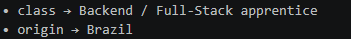

### Full-Stack Developer

<table border="0">
  <tr>
    <td align="center" valign="middle">
      
    </td>
    <td align="center" valign="middle">
      
    </td>
  </tr>
</table>

 

---

### Technologies

---

### Statistics

<table width="100%">
<tr>
<td width="60%">

</td>
<td width="40%" align="center">

</td>
</tr>
</table>

---

### Contribution Graph

